# Fluxx — Le fonctionnement expliqué simplement

> Ce document décrit **à quoi sert Fluxx** et **comment il fonctionne**, sans entrer dans le détail technique.

---

## En résumé

Fluxx est un outil qui **fait passer des données d'un système à un autre**, de façon fiable, automatique et surveillée.

Il peut connecter un système **source** à un système **cible** quelconque (CRM, annuaire d'entreprises, base de référentiel, outil métier, etc.).

L'idée : plutôt que d'écrire à chaque fois une synchronisation « maison » fragile, on **décrit** la synchro comme une suite d'étapes, et Fluxx se charge tout seul de l'exécuter, de la surveiller, et de la reprendre en cas de souci.

---

## 1. À quoi ça sert ?

Fluxx sert à **orchestrer des synchronisations de données entre plusieurs systèmes**, typiquement :

> On a des données ici (un système source), on veut les mettre à jour là (un système cible), sans doublons, sans pertes, et avec la possibilité de tout revoir et de recommencer si besoin.

### Les problèmes qu'il résout

| Sans Fluxx | Avec Fluxx |
|---|---|
| Chaque synchro est codée à la main, fragile | On décrit la synchro une fois, Fluxx l'exécute |
| En cas d'erreur, on recommence souvent tout | On ne relance que ce qui a échoué |
| Deux déclenchements simultanés créent des doublons | Les exécutions concurrentes sont bloquées |
| Un travail déjà fait est refait inutilement | Fluxx détecte et évite de refaire le travail |
| On ne sait pas où en est la synchro | Un tableau de bord montre l'avancement en direct |
| Les erreurs sont noyées dans des logs | Chaque erreur est classée et expliquée |
| Pas d'historique, pas d'audit | Tout est tracé : qui, quand, quoi, combien, erreurs |

---

## 2. Comment ça marche — la grande image

Une synchronisation dans Fluxx s'appelle un **workflow**. Un workflow est une **succession d'étapes**, un peu comme une recette de cuisine :

```
Lire → Transformer → Écrire
```

1. **On déclenche** le workflow (manuellement, par un appel API, ou par un webhook externe).
2. Fluxx crée une **exécution** (un « run ») et lui attribue un identifiant unique.
3. Il exécute la première étape, puis enchaîne sur la suivante, et ainsi de suite.
4. À chaque étape, il **enregistre** ce qui a été fait : les données lues, transformées, écrites, les éventuelles erreurs, le temps passé, le nombre d'enregistrements traités.
5. À la fin, il marque l'exécution comme **terminée**, **en échec partiel**, ou **en échec**.

> ⚙️ Le tout se fait **en arrière-plan** : celui qui déclenche la synchro n'attend pas qu'elle finisse. Il reçoit juste un identifiant et peut consulter l'avancement plus tard.

---

## 3. Les étapes d'un workflow

Fluxx propose cinq types d'étapes, chacune avec un rôle précis :

| Étape | Rôle |
|---|---|
| **Lecture** | Aller chercher les données dans le système source |
| **Découpage** | Séparer/partitionner les données (ex. par lots) |
| **Transformation** | Nettoyer, normaliser, convertir les données |
| **Écriture** | Envoyer les données vers le système cible |
| **Liaison** | Mettre en correspondance des enregistrements entre les deux systèmes |

Il est également possible de **déclarer et implémenter des types d'étapes personnalisés** pour couvrir des besoins métier spécifiques au-delà des cinq types standards.

Certaines étapes peuvent dépendre d'autres : on ne peut pas écrire tant que la lecture et la transformation ne sont pas finies. Fluxx gère ces **dépendances** tout seul et enchaîne automatiquement.

---

## 4. Déclenchement

Une synchro peut être lancée de plusieurs façons :

- **Manuellement**, par un opérateur depuis l'interface ou en ligne de commande,
- **Automatiquement**, lorsqu'un système externe envoie un signal (un webhook, un appel API),
- **À l'occasion d'un événement métier** (soumission d'un formulaire, création/mise à jour/suppression via l'API).

Au moment du déclenchement, on peut transmettre des informations contextuelles : un identifiant de lot (`batch`), des paramètres (filtres, offsets, limites), un nom d'opérateur, une raison, etc.

---

## 5. Éviter les doublons et les conflits

C'est l'un des apports forts de Fluxx.

### Bloquer les exécutions concurrentes
Si une synchro est déjà en cours pour une même portée (un workflow, ou un workflow + un système source, etc.), Fluxx **refuse** d'en lancer une seconde en parallèle : on évite ainsi les écritures en double sur le système cible.

### Récupérer les blocages
Si un worker s'arrête brutalement (panne, redéploiement), il peut laisser un verrou « abandonné » qui bloquerait toutes les exécutions suivantes. Fluxx **détecte** ces verrous abandonnés (en surveillant l'activité des workers) et les **nettoie** automatiquement.

### Ne pas refaire un travail déjà fait
Quand une étape est identifiée comme « déjà exécutée avec les mêmes données en entrée », Fluxx **ne la rejoue pas** : il reprend directement les résultats déjà produits. C'est la **déduplication**.

---

## 6. Les erreurs et les reprises

Fluxx **distingue deux natures d'erreurs** :

| Nature | Exemple | Comportement |
|---|---|---|
| **Technique** | API indisponible, timeout réseau, base injoignable | **Réessayée automatiquement** (3 fois par défaut, avec un délai croissant) |
| **Métier** | Donnée invalide, code inconnu, condition non remplie | **Marquée en échec définitif**, pas de réessai automatique |

Cette distinction évite les boucles infinies : on ne retente pas éternellement quelque chose qui ne marchera jamais.

### Relancer après un échec
À partir d'une exécution échouée, on peut la relancer de trois manières :

- **Complète** : tout refaire du début,
- **Une étape précise** : ne refaire que l'étape fautive et ses conséquences,
- **Une branche** : refaire à partir d'une étape donnée, tout en conservant les résultats des étapes précédentes.

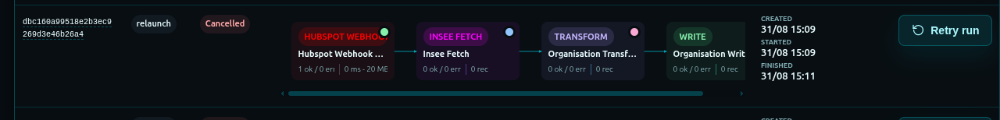

### Annuler en cours
Il est possible d'**annuler** une synchro en cours : Fluxx marque l'exécution comme annulée, annule les étapes en attente, relâche les verrous, et arrête la propagation. Les messages déjà en file s'auto‑neutralisent en voyant le run annulé.

---

## 7. Ce que Fluxx trace

Chaque exécution laisse une **trace complète** :

- **Identifiant** unique de l'exécution,
- Workflow concerné, système source et cible,
- Mode de déclenchement (manuel, webhook, API), éventuel lot de rattachement,
- **Statut** (en cours, terminé, en échec, partiellement échoué, annulé, en rechec...),
- Horodatages (création, début, fin),
- **Compteurs** par étape : enregistrements traités / réussis / en erreur,
- **Durée** et **consommation mémoire** de chaque étape,
- **Payloads** : les données réellement lues et produites à chaque étape (compressés pour économiser de la place, avec une empreinte de contrôle pour détecter toute altération),
- **Erreurs** classées (technique vs métier), avec message, code métier, contexte et instant de survenue,
- **Contexte de relance** et **d'annulation** (qui, quand, pourquoi).

Ces payloads conservés sont ce qui permet de **rejouer une branche** sans relire tout le jeu de données.

---

## 8. Le tableau de bord opérationnel

Fluxx expose une **interface web** (sous `/fluxx`) qui permet de tout piloter visuellement. Les écrans suivants sont disponibles :

### Authentification
**Connexion** — page de login pour accéder à l'espace d'exploitation.

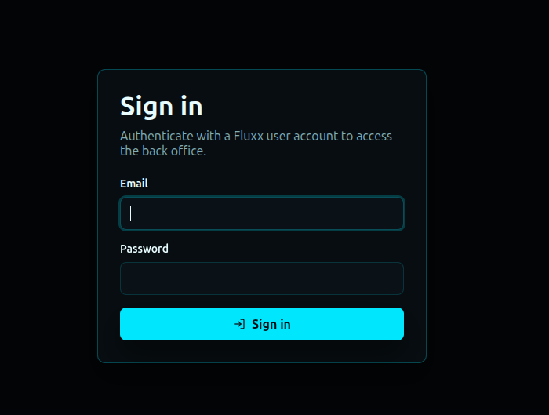

### Workflows
**Tableau de bord des workflows** — vue d'ensemble de toutes les synchronisations déclarées.

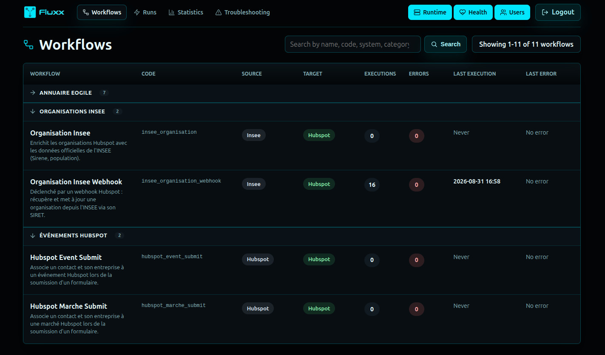

**Détail d'un workflow — onglet Étapes** — le graphe des étapes et leurs dépendances.

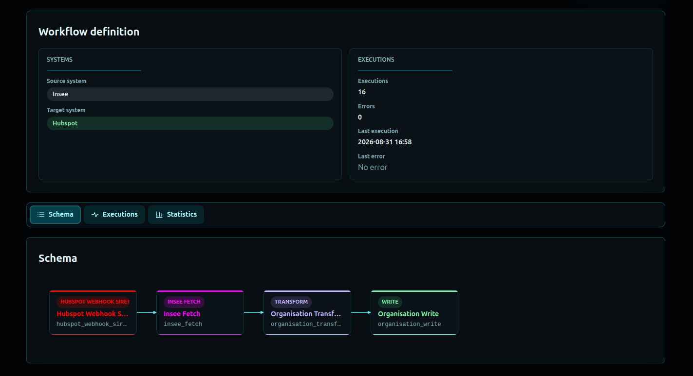

**Détail d'un workflow — onglet Exécutions** — l'historique des exécutions de ce workflow.

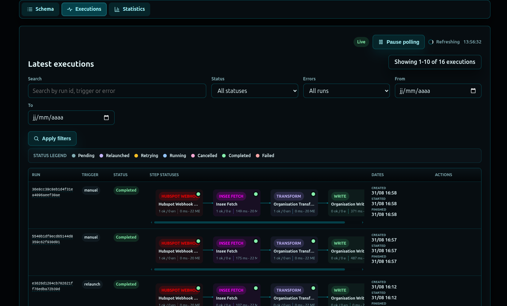

**Détail d'un workflow — onglet Statistiques** — compteurs et tendances.

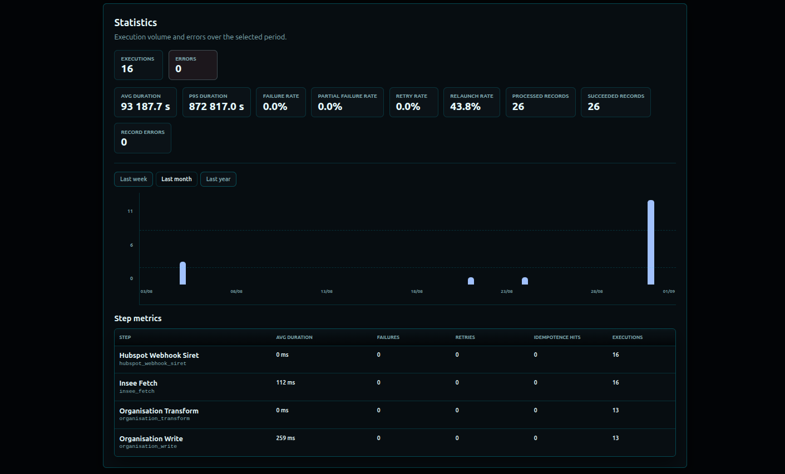

### Exécutions
**Catalogue des exécutions** — recherche filtrée parmi toutes les exécutions (par statut, par workflow, présence d'erreurs).

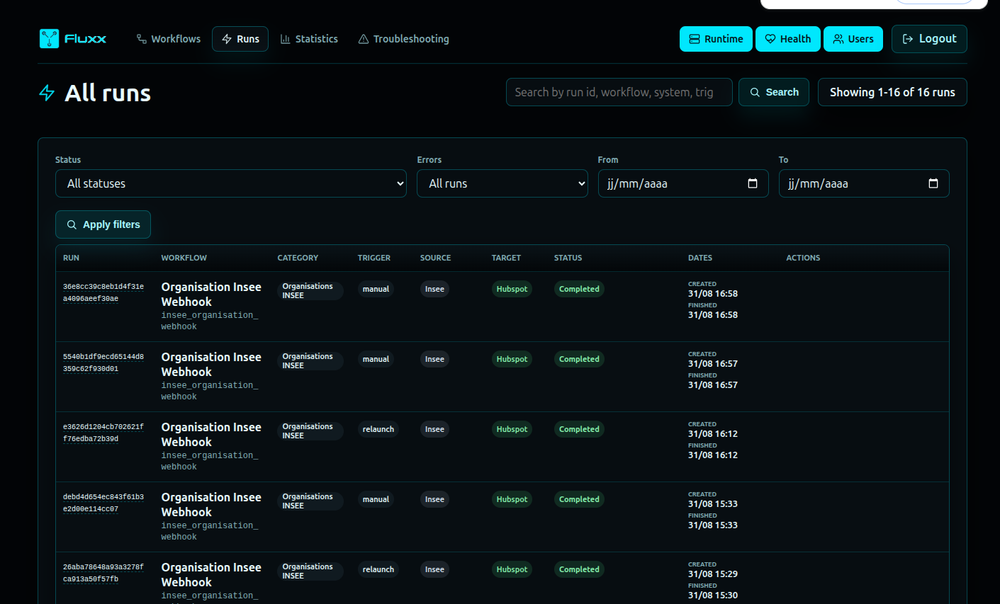

**Détail d'une exécution** — fiche complète d'un run, avec toutes ses étapes et les actions relancer/annuler.

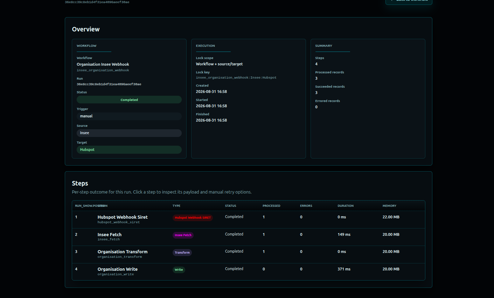

**Détail d'une étape** — ce qui s'est passé à une étape précise (données, compteurs, erreurs, retry, idempotence) et le bouton relancer cette étape.

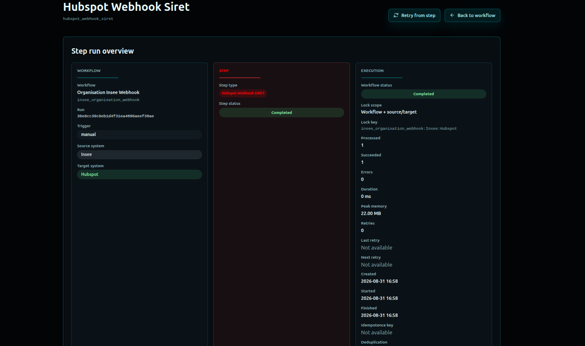
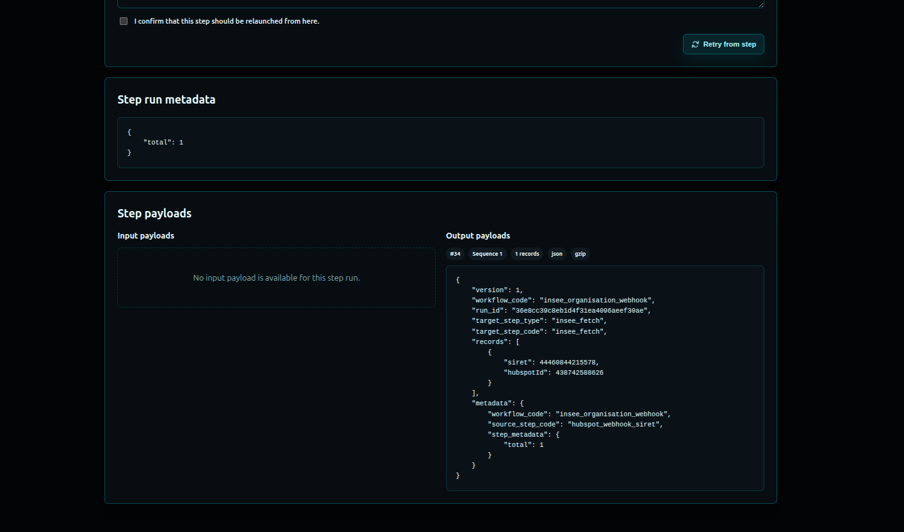

### Surveillance en direct
**Runtime dashboard** — vue **temps réel** : workers actifs (ce qu'ils sont en train de traiter, depuis combien de temps, leur mémoire), file de messages en attente, messages en cours de traitement, verrous actifs.

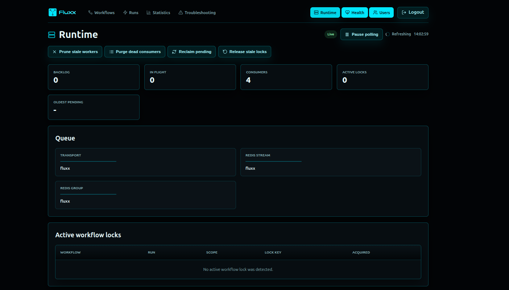
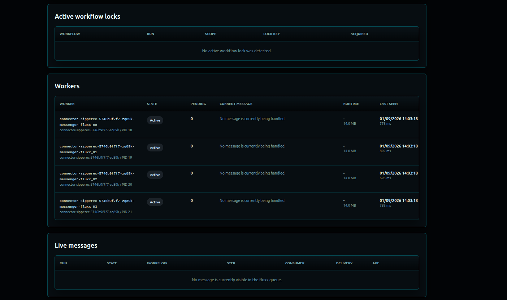

**Santé système** — état des composants (Redis, base de données, workers).

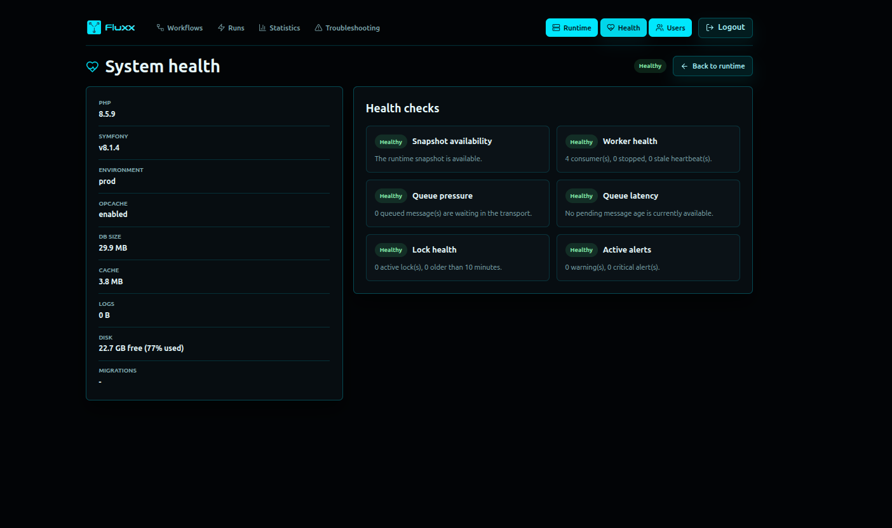

### Statistiques, utilisateurs
**Statistiques globales** — activité agrégée (succès, échecs, relances).

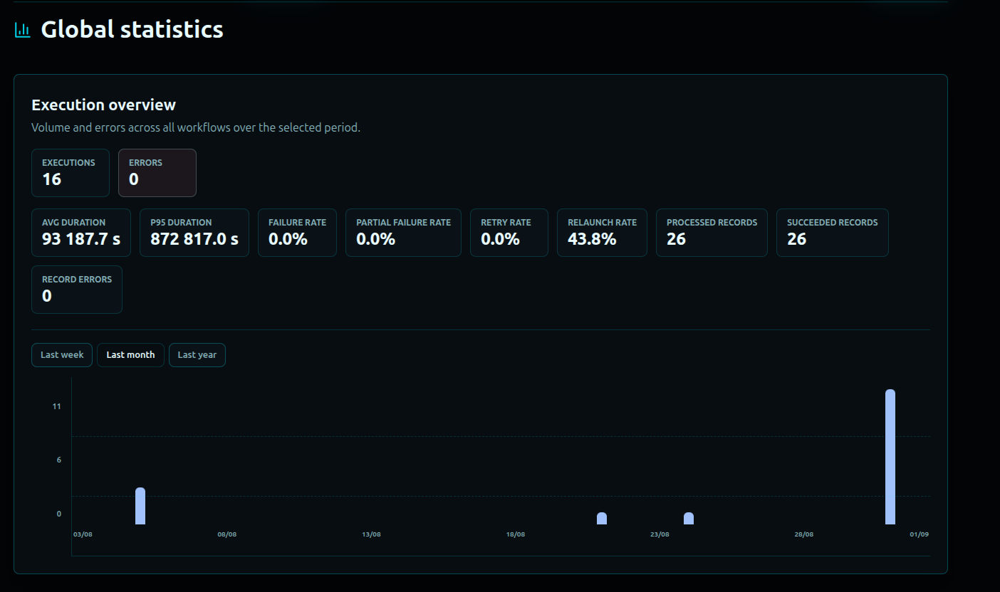

**Utilisateurs** (réservé aux administrateurs) — création/édition/activation des comptes.

### Rapport quotidien
Un **récapitulatif quotidien** de l'activité des workflows peut être envoyé par email.

---

## 9. La ligne de commande (pour l'exploitation)

Pour les opérations en masse ou les interventions d'incident, Fluxx fournit des commandes :

- Créer un compte opérateur,
- Lancer un workflow (avec paramètres),
- Lister / filtrer les exécutions,
- Relancer une exécution complète,
- Relancer **une étape précise** d'une exécution,
- Inspecter l'état du runtime.

Ce sont les mêmes actions que dans l'interface, mais pilotables en script ou en direct.

---

## 10. Les différents statuts

### Statut d'une exécution
| Statut | Signification |
|---|---|
| En attente | Créée, pas encore démarrée |
| En cours | Au moins une étape tourne |
| En recheche | Reprise automatique en cours après erreur technique |
| Relancée | Reprise manuelle déclenchée |
| Terminée | Tout est allé au bout |
| Partiellement échouée | Certaines étapes ont réussi, d'autres non |
| Échouée | Échec global |
| Annulée | Arrêtée par un opérateur |

### Statut d'une étape
Mêmes idées : en attente, en cours, en recheche, relancée, terminée, échouée, annulée.

> Quand un run est en échec **partiel**, l'opérateur sait qu'il n'a probablement à relancer que la **branche d'écriture**, et non tout refaire depuis la lecture.

---

## 11. En synthèse — ce que Fluxx permet

1. **Décrire** une synchronisation comme une suite d'étapes claires, modifiable en code.
2. **Lancer** ces synchronisations depuis n'importe où (interface, API, webhook, ligne de commande).
3. **Exécuter en arrière‑plan** de façon résiliente, sans bloquer l'appelant.
4. **Empêcher** les doublons (verrous d'exécution + déduplication).
5. **Reprendre** intelligemment après un échec (étape seule, branche, ou tout).
6. **Annuler** proprement une exécution en cours.
7. **Distinguer** erreurs techniques (réessayées) et métier (non réessayées).
8. **Tout tracer** : données, compteurs, durées, erreurs, contexte.
9. **Surveiller en direct** : qui fait quoi, depuis quand, où sont les blocages.
10. **Piloter** par l'interface et la ligne de commande.
11. **Auditer** grâce à l'historique complet et au récap quotidien.

### Ce que Fluxx n'est pas
- Ce n'est pas un CRM,
- ce n'est pas un système de stockage,
- ce n'est pas un ETL généraliste.

C'est un **moteur d'orchestration de connecteurs** : il structure, exécute et observe des synchronisations. Les intégrations spécifiques à chaque système source/cible restent, elles, dans l'application hôte.

---

## 12. Vocabulaire rapide

| Terme | Définition courte |
|---|---|
| **Workflow** | Une synchronisation décrite comme suite d'étapes |
| **Étape** | Une action du workflow (lire, transformer, écrire...) |
| **Run** | Une exécution d'un workflow |
| **Trigger** | Ce qui a déclenché le run (manuel, webhook, API) |
| **Batch** | Un identifiant de lot, pour regrouper des runs liés |
| **Payload** | Les données concrètes lues/produites à une étape |
| **Verrou** | Mécanisme empêchant deux exécutions concurrentes |
| **Idempotence / déduplication** | Empêche de refaire un travail déjà fait |
| **Runtime** | L'état courant des workers, files et verrous |
| **Système source / cible** | Les deux systèmes que Fluxx relie lors d'une synchronisation |
