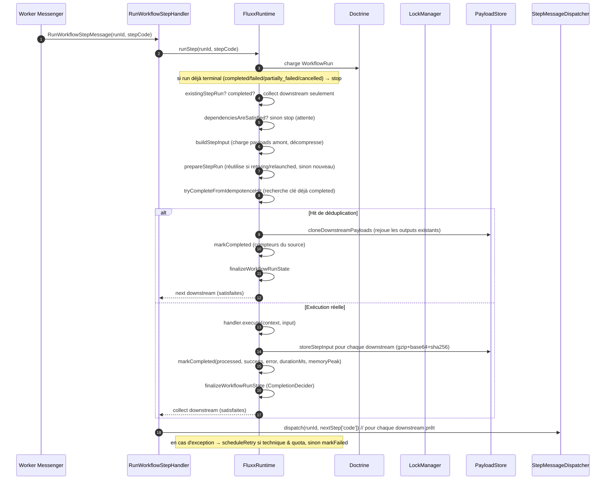
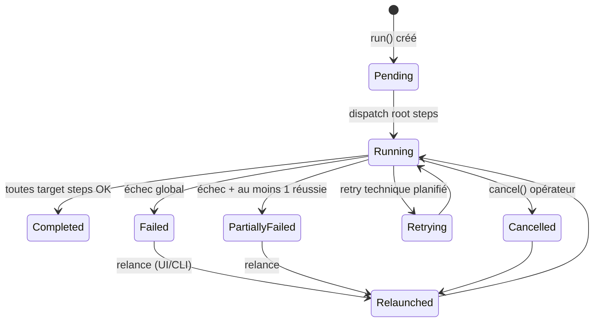
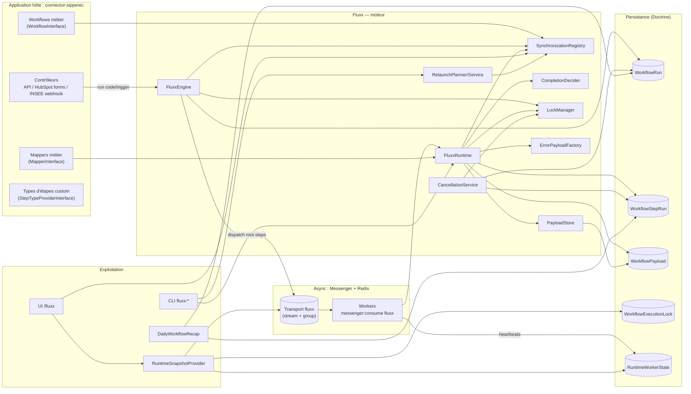

# Fluxx — Moteur d'orchestration de synchronisations opérationnelles

> Document de référence : à quoi sert Fluxx, ce qu'il permet, et comment il fonctionne techniquement.
> _Emplacements marqués `🖼️` : insérer vos captures d'écran._

---

## TL;DR fonctionnel

Fluxx est un **bundle Symfony** qui transforme le besoin récurrent « synchroniser des données d'un système A vers un système B, de façon fiable et observable » en quelque chose de **déclaratif, asynchrone, traçable et pilotable**.

Concrètement, dans `connector-sipperec`, Fluxx est le socle commun à tous les connecteurs métier :

- **Eogile → HubSpot** (sociétés, contacts, fonctions),
- **INSEE → HubSpot** (enrichissement d'entreprise via webhook),
- **HubSpot → interne** (soumission de formulaires, événements marché).

Le développeur **déclare** un workflow (un graphe d'étapes) en PHP ; Fluxx **exécute** chaque étape de façon asynchrone (via Messenger/Redis), **garantit** qu'il n'y a pas de double exécution concurrente (verrous + idempotence), **trace** tout (run, étape, payload, erreur, retry, métriques durée/mémoire), et expose une **UI d'exploitation** + une **CLI** pour lancer, surveiller, relancer, annuler et diagnostiquer.

**En une phrase** : Fluxx fait en sorte qu'une synchronisation de données soit **déclarée en code**, **exécutée résiliente**, **observable étape par étape**, et **actionnable** en exploitation.

---

## 1. Le problème que Fluxx résout

Sans un socle dédié, chaque connecteur réinvente :

| Problème | Sans Fluxx | Avec Fluxx |
|---|---|---|
| Lancer une synchro | Code ad hoc dans un controller, bloquant | `FluxxEngine::run(code, trigger)` — asynchrone |
| Enchaîner étapes (lire → transformer → écrire) | Appels chaînés manuels | Graphe d'étapes avec `dependsOn` |
| Éviter deux exécutions concurrentes | Verrous maison, rarement fiables | Verrous multi‑portées + récupération des verrous « stale » |
| Rejouer une synchro échouée | Reprise manuelle, souvent depuis le début | Relance **totale**, **par étape** ou **par branche** |
| Éviter de refaire un travail déjà fait | Pas géré | Idempotence + déduplication réutilisant les payloads |
| Comprendre un échec | Logs à parcourir | Erreurs classées (technique vs métier) + payload d'erreur structuré |
| Surveiller l'avancement | Aucune visibilité | Dashboard runtime (workers, verrous, backlog, messages en vol) |
| Diagnostiquer un blocage | Empirique | Introspection Redis stream + heartbeat workers |
| Auditer | Non traçable | Historique complet run/étape + payloads compressés conservés |

Fluxx ramène toute la plomberie d'orchestration/résilience/observabilité **hors du code métier**, qui ne fournit plus que les handlers d'étapes et les mappers de champs.

---

## 2. Ce qu'est Fluxx techniquement

- **Package** : `sevj/fluxx` (dépôt VCS `https://github.com/sevj/fluxx`), requis en `^1.1.2` dans `../../../../composer.json`.
- **Forme** : un `Symfony Bundle` (`Fluxx\FluxxBundle`), activé dans `../../../../config/bundles.php`.
- **Routage** : routes chargées depuis `@FluxxBundle/Controller/` dans `../../../../config/routes.yaml`.
- **PHP** : `>=8.5`, Symfony `8.1.*`, Doctrine ORM `>=3.3.1`.
- **Transport** : Redis (stream + consumer group) via Symfony Messenger.
- **Discipline interne** (voir `AGENTS.md` du package) : architecture `Entity/Repository/Service`, controllers minces, logique métier dans des services, Twig pour l'UI, traductions pour tout texte visible, code en anglais.

Structure du package (`../src`) :

```
Client/  Command/  Controller/  DependencyInjection/  Entity/  Mapper/
Operations/  Reporting/  Repository/  Resources/  Runtime/  Settings/
StepType/  Ui/  User/  Workflow/
```

---

## 3. Concepts fondamentaux

### 3.1 Le workflow = une définition en code

Un workflow est une classe implémentant `Fluxx\Workflow\WorkflowInterface` qui retourne une `WorkflowDefinition`. **Aucune table ne stocke les définitions** : elles sont lues depuis le conteneur de services via la `SynchronizationRegistry` — donc versionnées en code review.

Signature réelle :

```php
final readonly class WorkflowDefinition
{
    public function __construct(
        string $code,                  // ex. 'contacts'
        string $name,                  // libellé affiché
        string $sourceSystem,          // ex. 'CSV'
        string $targetSystem,          // ex. 'Hubspot'
        array $steps,                  // list<WorkflowStepDefinition>
        ?WorkflowExecutionLockConfiguration $lock = null,
        ?WorkflowRetryPolicy $retryPolicy = null,
        ?string $description = null,
        ?string $category = null,
    );
}
```

Le constructeur **valide le graphe** dès l'instanciation :
- pas de code d'étape en double,
- toute dépendance référencée existe,
- un verrou de partition métier exige une clé de metadata.

Services auto‑taggés `fluxx.workflow` (`_instanceof` dans `../../../../config/services.yaml`).

### 3.2 Les étapes et le graphe

`WorkflowStepDefinition` :

```php
public function __construct(
    string $code,                                  // identifiant d'étape
    string $name,                                 // libellé
    string $type,                                 // 'read'|'splitter'|'transform'|'write'|'linker'
    ExecutableWorkflowStepInterface $handler,
    array $dependsOn = [],                        // list<string> codes d'étapes amont
    ?WorkflowStepIdempotence $idempotence = null,
    ?WorkflowRetryPolicy $retryPolicy = null,
);
```

Le graphe est exprimé par `dependsOn`. La `WorkflowDefinition` expose alors des primitives de navigation :

| Méthode | Rôle |
|---|---|
| `rootSteps()` | Étapes sans dépendance (points d'entrée du run) |
| `downstreamSteps($code)` | Étapes qui dépendent directement de `$code` |
| `descendantsOf($code)` | Sous‑graphe aval complet (BFS) — utilisé pour la relance « par branche » |
| `ancestorsOf($code)` | Sous‑graphe amont complet (récursif) — étapes dont on peut réutiliser les payloads |
| `positionOf($code)` | Numéro d'ordre d'affichage de l'étape |
| `step($code)` | Accès/resolution d'une étape (lève `InvalidArgumentException` si absente) |

Cas validé au démarrage : `if ($step->dependsOn() === []) $step->isRoot() === true`.

### 3.3 Les types d'étapes

Built‑in (`BuiltinStepTypeProvider`) :

| Type | Rôle fonctionnel |
|---|---|
| `read` | Lecture depuis le système **source** |
| `splitter` | Découpage / partitionnement des enregistrements |
| `transform` | Transformation (mappage, normalisation, nettoyage) |
| `write` | Écriture vers le système **cible** |
| `linker` | Liaison/rapprochement d'enregistrements entre systèmes |

Types personnalisés : implémenter `Fluxx\StepType\StepTypeProviderInterface` (auto‑tag `fluxx.step_type_provider`). Chaque `StepTypeDefinition` porte un `code`, un `label` et un **`tone`** — soit un nom de classe CSS (`read`, `write`...), soit une **couleur hex**, qui génère alors style `--step-tone-text/bg` dynamique (utilisée par l'UI pour colorer chaque type d'étape).

### 3.4 Le handler d'étape

Chaque étape est portée par un service implémentant `Fluxx\Workflow\Step\ExecutableWorkflowStepInterface`. Fluxx lui passe :

- `WorkflowContext` — identité du run + metadata de workflow,
- `WorkflowStepInput` — liste des payloads d'entrée venant des étapes amont,
- et attend en retour un `WorkflowStepResult`.

```php
final readonly class WorkflowStepResult
{
    public function __construct(
        array $records = [],          // enregistrements produits
        array $metadata = [],
        ?int $processedCount = null,
        ?int $successCount = null,
        int $errorCount = 0,
        array $branchOutputs = [],    // array<string, WorkflowStepOutput> par étape cible
    );
    public function outputFor(string $targetStepCode): WorkflowStepOutput;
}
```

> ⚙️ **Fonctionnellement** : `branchOutputs` permet à une étape de produire **un jeu de données différent par étape aval**. Par défaut (si aucune branche nommée ne correspond), les `records`/`metadata` sont utilisés pour tous les downstream.

Quant aux **compteurs** : `processedCount()` vaut le nombre de records par défaut ; `successCount()` vaut `processed - error` au minimum 0. Ces compteurs alimentent les compteurs d'exécution et le récap quotidien.

### 3.5 Les mappers (transformation de champs)

La transformation champ‑par‑champ est externalisée dans des **mappers** implémentant `Fluxx\Mapper\MapperInterface` (auto‑tag `fluxx.mapper`). Dans `connector-sipperec`, ils sont collectés via :

```yaml
# config/services.yaml
bind:
  $fluxxMapper: !tagged_iterator { tag: 'fluxx.mapper', default_index_method: 'getDefinition' }
```

Chaque mapper expose une **clé de définition** statique. Exemple réel (`../../../../src/Mapper/Eogile/Company/Siret.php`) :

```php
final readonly class Siret implements MapperInterface
{
    public function treat(string|array $data): string
    {
        if (is_array($data)) {
            return $data['properties']['siret'] ?? $data['siret'] ?? '';
        }
        return (string) $data;
    }
    public static function getDefinition(): string { return 'eogile.company.siret'; }
}
```

Mappers métier fournis dans le projet : `Siret`, `NumeroInsee`, `Name`, `RaisonSociale`, `Domain`, `Website`, `Address`, `City`, `Zip`, `PopulationTotale`, `NombreLogements`, `CategorieJuridique`, `TypeOrganisation`, `CodeInsee`, `DateLastUpdateInsee`, `MessageLastUpdateInsee` (côté INSEE) ; `Firstname`, `Lastname`, `Email`, `Phone`, `AcceptedEmailing`, `AccesEspaceAdherent` (côté contact) ; `Titre`, `Label`, `DateFin`, `Disabled` (côté fonction) ; plus `Utils\TrimMapper`.

---

## 4. Démarrage d'une exécution : `FluxxEngine`

Point d'entrée unique appelé par les controllers hôtes :

```php
public function run(
    string $workflowCode,
    string $trigger = 'manual',
    ?string $batchId = null,
    array $metadata = [],
): string;          // retourne le runId
```

Séquence :

1. `SynchronizationRegistry::get($workflowCode)` → définition,
2. génération d'un `runId` (32 caractères hexa aléatoires),
3. création d'une entité `WorkflowRun` (source/cible/trigger/batchId/metadata), marquée `running`,
4. **acquisition du verrou** d'exécution (`WorkflowExecutionLockManager::acquire`),
5. persistence Doctrine,
6. **dispatch des étapes racines** dans le bus Messenger (`StepMessageDispatcher::dispatch`),
7. retour du `runId`.

Si le dispatch échoue, le run est marqué `failed`, le verrou relâché (`releaseForRun(..., 'dispatch_failed')`, et l'exception remonte.

**Fonctionnellement** : un trigger (webhook HubSpot, webhook INSEE, appel API, action manuelle UI) appelle simplement `run()`. À partir de là, le workflow s'exécute de façon asynchrone et indépendante : l'appelant n'attend pas la fin.

---

## 5. Exécution asynchrone (Messenger + Redis)

### 5.1 Le message et son handler

```php
#[AsMessageHandler]
final readonly class RunWorkflowStepHandler
{
    public function __invoke(RunWorkflowStepMessage $message): void
    {
        foreach ($this->fluxxRuntime->runStep($message->runId(), $message->stepCode()) as $nextStep) {
            StepMessageDispatcher::dispatch($this->messageBus, $message->runId(), $nextStep['code']);
        }
    }
}
```

`StepMessageDispatcher` supporte un **delay** (via `DelayStamp`), utilisé notamment pour planifier un retry :

```php
StepMessageDispatcher::dispatch($bus, $runId, $stepCode, $delayMilliseconds = 0);
```

### 5.2 Transport & workers (configuration réelle de `connector-sipperec`)

```yaml
# config/packages/messenger.yaml
framework:
    messenger:
        failure_transport: failed
        transports:
            fluxx:
                dsn: '%env(MESSENGER_TRANSPORT_FLUXX_DSN)%'   # redis://.../fluxx/fluxx
                retry_strategy:
                    max_retries: 3
                    multiplier: 2
            failed: 'doctrine://default?queue_name=failed'
        routing:
            Fluxx\Workflow\Message\RunWorkflowStepMessage: fluxx
```

- **1 transport dédié** `fluxx` (Redis stream + consumer group), **1 queue d'échecs** Doctrine.
- Workers lancés via `../../../../bin/start-messenger-fluxx.sh` (DSN suffixée par `CONSUMER_NAME`) + supervisor (`messenger.conf`).
- L'application peut faire tourner **plusieurs workers** : chacun a un nom de consumer Redis stable, ce qui est crucial pour corréler l'état runtime.

---

## 6. Le cœur : `FluxxRuntime::runStep()`

C'est le moteur d'exécution d'une étape, appelé par le handler Messenger. Pipeline détaillé :



Détails importants du `FluxxRuntime` :

| Étape | Détail technique |
|---|---|
| Reprise sur `retrying`/`relaunched` | `prepareStepRun()` réutilise le `WorkflowStepRun` existant et le repasse en `running` (pas de doublon d'entité) |
| `dependenciesAreSatisfied()` | Vérifie que chaque `dependsOn` a un `WorkflowStepRun` complété |
| `buildStepInput()` | Recharge les `WorkflowPayload` ciblant l'étape, décompresse et fournit `WorkflowStepInputPayload[]` (records, metadata, snapshot) |
| Métriques | `durationMs` via `hrtime(true)` ; `memoryPeakBytes` via `memory_get_peak_usage(true)` (avec `memory_reset_peak_usage` si dispo) |
| Annulation propagée | `synchronizeCancelledRunIfNeeded()` : à chaque exécution, si l'état persisté du run est devenu `cancelled` (par l'UI/CLI), le runtime le réapplique en mémoire et stoppe — l'exécution en cours ne génère pas de downstream |
| Décision finale | `finalizeWorkflowRunState()` délègue à `WorkflowRunCompletionDecider` et relâche le verrou selon l'issue |

### 6.1 Détection de complétion : `WorkflowRunCompletionDecider`

Le décideur évalue, pour chaque étape cible (du run complet ou du **sous‑ensemble ciblé par une relance**), un état derivé :

| État derivé | Source |
|---|---|
| `completed` | stepRun status = `Completed` |
| `failed` | `Failed` **ou** `Cancelled` |
| `running` | `Running` |
| `retrying` | `Retrying` |
| `runnable` | pas de stepRun et toutes dépendances `completed` |
| `waiting` | dépendances encore actives/runnables |
| `blocked` | dépendances bloquées |

Décision finale du run :

- toutes `completed` → **`Completed`** (et relâche le verrou `'completed'`),
- échec et **au moins une réussie** → **`PartiallyFailed`**,
- échec et **aucune réussie** → **`Failed`**,
- il reste du `running`/`runnable`/`waiting` ou pas d'échec encore → `null` (run reste `Running`),
- tout `retrying` → run marqué `Retrying` (pas terminal).

> ⚙️ **Fonctionnellement** : un run où la lecture a réussi mais l'écriture a échoué apparaîtra `partially_failed`, ce qui est plus honnête qu'un échec global — l'opérateur sait qu'il peut ne relancer que la branche d'écriture.

---

## 7. Verrous d'exécution

`WorkflowExecutionLockManager` empêche les doubles exécutions concurrentes selon une **portée** configurable :

```php
enum WorkflowExecutionLockScope: string {
    case Workflow = 'workflow';                       // 1 seul run du workflow à la fois
    case WorkflowSource = 'workflow_source';           // + système source
    case WorkflowSourceTarget = 'workflow_source_target';
    case WorkflowBusinessPartition = 'workflow_business_partition'; // + clé métier
}
```

`WorkflowExecutionLockConfiguration` :

```php
new (WorkflowExecutionLockScope $scope = Workflow,
     ?string $businessPartitionMetadataKey = null,
     int $staleTimeoutSeconds = 900)  // défaut 15 min
```

### Construction de la `lockKey`

| Portée | Segments de la clé (`:`‑séparés) |
|---|---|
| `Workflow` | `<workflowName>` |
| `WorkflowSource` | `<workflowName>:<sourceSystem>` |
| `WorkflowSourceTarget` | `<workflowName>:<sourceSystem>:<targetSystem>` |
| `BusinessPartition` | `<workflowName>:<partitionValue>` — exige la clé metadata, `InvalidArgumentException` sinon |

### Récupération des verrous « stale » (`shouldRecoverStaleLock`)

À l'`acquire()`, si un verrou actif appartient à un **autre** run :

- si le run propriétaire est introuvable **ou** déjà dans un état terminal (`Completed`/`Cancelled`/`Failed`/`PartiallyFailed`) → récupération (`release('stale_recovered')`),
- sinon, si **aucun worker actif** pour ce run depuis `staleTimeoutSeconds` (heartbeats via `RuntimeWorkerStateLookupInterface`) → récupération,
- sinon → lève `WorkflowExecutionLockConflict(workflowCode, lockKey, activeRunId)`.

> ⚙️ **Fonctionnellement** : un worker tué brutalement laisse un verrou « abandonné » ; Fluxx le détecte via l'absence de heartbeat et le nettoie automatiquement, plutôt que de bloquer indéfiniment les prochaines exécutions.

---

## 8. Idempotence & déduplication

Une étape peut déclarer une `WorkflowStepIdempotence` (stratégie par défaut `'step_input_key'`). Son handler doit alors aussi implémenter `IdempotentWorkflowStepInterface` et produire une **clé d'idempotence** via `idempotenceKey(context, input)`.

Pipeline de `tryCompleteFromIdempotenceHit()` :

1. calcul de la clé (lève `RuntimeException` si l'idempotence est activée mais le handler non compatible),
2. recherche d'un `WorkflowStepRun` **déjà complété** pour le même workflow + même step + même clé,
3. **Hit** → l'étape courante est marquée `Deduplicated` :
   - `markDeduplicated()` relie à l'étape source (`deduplicatedFromStepRun`),
   - les **payloads downstream sont clonés** depuis le stepRun source (`cloneDownstreamPayloads`) — on rejoue donc sans recalculer,
   - `markCompleted()` reprend les compteurs (processed/success/error) du source,
4. **Pas de hit** → `markIdempotenceApplied(clé)` est posé avant exécution (la clé est enregistrée pour que les futures exécutions se dédupliquent sur celle-ci).

Statuts de déduplication (`WorkflowStepDeduplicationStatus`) :

| Statut | Sens |
|---|---|
| `None` | Pas d'idempotence pour cette étape |
| `Applied` | Clé enregistrée, exécution réelle faite (référence future) |
| `Deduplicated` | Cette exécution a été court‑circuitée en réutilisant une précédente |

> ⚙️ **Fonctionnellement** : si deux webhooks déclenchent la synchro d'un même enregistrement en peu de temps, la seconde exécution ne répète pas les écritures sur HubSpot : elle réutilise les outputs de la première. C'est une garantie forte contre les écritures dupliquées côté cible.

---

## 9. Politique de retry

`WorkflowRetryPolicy` est configurable **par workflow** et/ou **par étape** (l'étape surclasse le workflow) :

```php
new WorkflowRetryPolicy(
    int $maxRetries = 3,
    int $delaySeconds = 60,
    WorkflowRetryBackoffStrategy $backoffStrategy = Fixed, // Fixed|Linear|Exponential
);
public function delayMillisecondsForAttempt(int $attempt): int
// Fixed       : base
// Linear      : base * attempt
// Exponential : base * 2^(attempt-1)
```

**Règles applicatives** (`scheduleRetryIfNeeded`) :

- retry **uniquement** si `errorPayload.category === 'technical'` (les erreurs métier ne retry **jamais automatiquement**),
- respect de `maxRetries`,
- l'étape passe à `Retrying`, le run passe à `Retrying`, et le message est **réinjecté avec un `DelayStamp`** = `delayMillisecondsForAttempt(retryCount+1)`,
- metadata `retry` enrichie (count, max_retries, delay, backoff, last/next retry timestamps).

> ⚙️ **Fonctionnellement** : une coupure réseau/temporaire de l'API HubSpot est retryée automatiquement ; un « code métier invalide » est marqué en échec définitif et exposé comme tel à l'opérateur, sans boucle de replay infinie.

---

## 10. Classification des erreurs

```php
enum WorkflowErrorCategory: string { case Technical = 'technical'; case Business = 'business'; }
```

- Toute exception qui n'implémente pas `WorkflowErrorInterface` est considérée **`technical`**.
- Les erreurs métier se lèvent via `BusinessWorkflowException(message, $workflowErrorCode, $context)` → catégorie `business`, avec code et contexte libre.

`WorkflowErrorPayloadFactory::fromThrowable()` produit le payload persisté :

```php
[
  'category'   => 'technical'|'business',
  'class'      => Exception::class,
  'message'    => '...',
  'code'       => ?string,        // pour les erreurs métier
  'context'    => array,          // pour les erreurs métier
  'occurred_at'=> <DATE_ATOM>,    // instant de l'erreur
]
```

Ce payload est stocké dans `metadata.error` du `WorkflowRun` **et** du `WorkflowStepRun`, et alimente l'UI (catégorie colorée, contexte) et la décision de retry.

Dans `connector-sipperec`, le `HubspotClient` lève explicitement `BusinessWorkflowException` pour signaler les conditions métier non retryables.

---

## 11. Annulation

`WorkflowCancellationService::cancel(runId, trigger='ui', reason, operatorUser)` :

- ignore les runs déjà terminaux (renvoie `false`),
- enrichit les metadata avec `cancellation` (trigger, reason, operator_user, cancelled_at),
- marque le run `Cancelled`,
- marque `Cancelled` toutes les étapesDraftes en `Pending`/`Relaunched`/`Retrying`,
- relâche le verrou (`'cancelled'`),
- Le runtime, lui, **détecte** l'annulation à chaque exécution d'étape (`synchronizeCancelledRunIfNeeded`) et stoppe la propagation : pas de dispatch downstream.

> ⚙️ **Fonctionnellement** : un opérateur peut arrêter une synchro en cours sans laisser de messages « zombies » dans la file — les messages déjà dispatchés s'auto‑neutralisent en voyant le run annulé.

---

## 12. Relance (Full / Step / Branch)

`WorkflowRelaunchMode` :

| Mode | Comportement |
|---|---|
| `Full` | Repart des **étapes racines**, cible **toutes** les étapes ; rien n'est préservé |
| `Step` | Repart d'**une étape** précise, cible ses **descendants** ; les **ancêtres** sont préservés |
| `Branch` | Comme `Step` du point de vue du plan (entrée = 1 étape, cible = descendants, préservés = ancêtres) |

`WorkflowRelaunchPlanner::plan(definition, mode, restartStepCode?)` produit un `WorkflowRelaunchPlan` :

```php
new WorkflowRelaunchPlan(
    mode: $mode,
    entryStepCodes: [...],     // étapes qu'on dispatche pour démarrer
    targetStepCodes: [...],    // étapes qui doivent réussir (borne le `CompletionDecider`)
    preservedStepCodes: [...], // étapes dont on réutilise les payloads déjà produits
);
```

Le `targetStepCodes` est mémorisé dans `WorkflowRun.metadata.relaunch.target_step_codes` et borne le `CompletionDecider` (qui ne juge la complétion que sur ce sous‑ensemble) — `completionStepCodes()` dans `FluxxRuntime` le reflète.

> ⚙️ **Fonctionnellement** : on peut relancer **juste l'étape d'écriture** d'un run en échec sans relire ni retransformer tout le jeu de données : les étapes amont « préservées » restent completed et leurs payloads sont repris.

---

## 13. Persistance & traçabilité

Entités Doctrine (préfixe table `fluxx_*`) :

### `WorkflowRun` (`fluxx_workflow_run`)
Champs : `run_id` (unique), `workflow_name`, `source_system`, `target_system`, `trigger`, `status`, `batch_id`, `metadata` (JSON), `created_at`, `started_at`, `finished_at`, `lock_key` (indexé), `lock_scope`, `error_message`.
Méthodes de transition d'état : `markRunning/Retrying/Relaunched/Completed/Cancelled/Failed/PartiallyFailed`, `attachExecutionLock`, accès à `relaunchMetadata()` / `cancellationMetadata()` / `errorPayload()` (extraits de `metadata`).

### `WorkflowStepRun` (`fluxx_workflow_step_run`)
Champs : `step_type`, `step_name`, `position`, `status`, `idempotence_key` (index), `deduplication_status`, `deduplicated_from_step_run_id` (index, FK SET NULL), `processed_count`, `success_count`, `error_count`, `duration_ms`, `memory_peak_bytes`, `retry_count`, `last_retry_at`, `next_retry_at`, `metadata` (JSON), horodatages, `error_message`.
Méthodes : `markRunning/Relaunched/Completed/Cancelled/Failed`, `scheduleRetry(...)`, `markIdempotenceApplied`, `markDeduplicated`.

### `WorkflowPayload` — snapshots compressés
`WorkflowPayloadStore::storeStepInput()` sérialise :

```php
[
  'version'          => 1,                    // version du format de snapshot
  'workflow_code'    => ...,
  'run_id'           => ...,
  'target_step_type' => ...,
  'target_step_code' => ...,
  'records'          => [...],
  'metadata'         => [...],
]
```

- `json_encode` → `gzencode(level=6)` → `base64_encode` → stocké en base (colonne `content`),
- `content_hash` = **SHA‑256 du JSON** (intégrité),
- `raw_size` / `stored_size` (suivi de compression),
- `record_count`, `sequence` (ordering par étape cible), `storage_mode='database'`, `compression='gzip'`, `format='json'`.

`load()` fait l'inverse (`base64_decode` → `gzdecode` → `json_decode`). C'est ce qui rend la **relance par branche** possible : les payloads amont sont rejouables tels quels.

### Autres entités persistées
- `WorkflowExecutionLock` — verrous actifs (scope, lock_key, businessPartitionKey, owner_run_id, acquiredAt, release reason),
- `RuntimeWorkerState` — heartbeat des workers (nom, hôte/PID, statut, dernier message transport, workflow/step/run en cours, démarré à, mémoire),
- `User` — comptes opérateurs (authentification `fluxx_users`),
- `FluxxSetting` — paramètres opérationnels persistés (UI Réglages).

---

## 14. Surveillance runtime (introspection Redis)

`FluxxRuntimeSnapshotProvider::snapshot()` interroge **directement Redis** pour fournir une vue temps réel :

- `XINFO CONSUMERS <stream> <group>` → état des consumers (pending, idle),
- `XPENDING <stream> <group>` + détails → messages en vol (pending list, deliveryCount, idleMs),
- `XRANGE` → message le plus ancien (âge du backlog).

Croisé avec l'état Doctrine (`RuntimeWorkerState`, définitions de workflow, locks actifs), le snapshot expose :

```php
[
  'ok' => bool,
  'refreshedAt' => <DATE_ATOM>,
  'summary' => [
    'backlogCount', 'inFlightCount', 'consumerCount', 'activeLockCount',
    'visibleMessageCount', 'oldestMessageAgeMs', 'oldestPendingAgeMs',
  ],
  'queue' => ['name'=>'fluxx', 'stream'=>..., 'group'=>...],
  'workers' => [ ... ],   // name, state, pendingCount, idleMs, lastSeenAt, host, pid,
                          // workflow courant, step courant, runId, processingDurationMs, memory...
  'activeLocks' => [ ... ],
  'messages' => [ ... ],  // id, state (queued|in_flight), consumerName, deliveryCount,
                          // ageMs, workflow, stepType+label+tone, status, durationMs, errorCategory...
]
```

### États de worker affichés (`resolveWorkerDisplayState`)

| État | Conditions |
|---|---|
| `processing` | `processing` + heartbeat frais (≤ 30 s) |
| `active` | idle ≤ 5 s (Redis) |
| `idle` | heartbeat frais sinon |
| `offline` | heartbeat > 30 s |
| `stopped` | statut persisté `stopped` |

> ⚙️ **Fonctionnellement** : l'exploitation voit en direct combien de messages attendent, quel worker traite quel run/étape depuis combien de temps, et où se trouvent les verrous — sans devoir fouiller Redis à la main.

---

## 15. Opérations & reporting

Le package expose des services d'**exploitation** (`src/Operations/`) :

| Service | Rôle |
|---|---|
| `RuntimeInspector` | Synthèse d'inspection du runtime (CLI `fluxx:runtime:inspect`) |
| `WorkflowRetryOperator` | Réapplique une politique de retry de façon programmée |
| `StaleLockReleaser` | Libère les verrous stale |
| `StaleWorkerPruner` | Nettoie les workers hors‑ligne |
| `DeadConsumerPurger` | Purge les consumers morts du group Redis |
| `PendingMessageReclaimer` | Réinjecte/reclaime les messages pending abandonnés |
| `WorkflowRunLister` / `WorkflowRunFilterFactory` / `WorkflowRunListing` | Listing/filtrage des runs (UI `runs/index` + CLI `fluxx:run:list`) |

Reporting : `DailyWorkflowRecap` (builder + mailer templates Twig `templates/email/daily_workflow_recap.{html,txt}.twig`) — récap quotidien de l'activité des workflows par email.

---

## 16. Interface d'exploitation (UI)

> Toutes les routes sont sous `/fluxx`, protégées par `ROLE_FLUXX_USER` (`/fluxx/users` réservé `ROLE_ADMIN`). Texte traduit via le système de traductions du bundle.

### 16.1 Authentification et accueil

🖼️ **`/fluxx/login` — Connexion** (`security/login.html.twig`)
Form login Symfony (`fluxx_login`/`fluxx_logout`); après connexion, redirection sur le tableau de bord des workflows.

### 16.2 Workflows

🖼️ **`/fluxx/workflows` — Tableau de bord des workflows** (`workflow/index.html.twig`)
Vue agrégée : tous les workflows déclarés (code, libellé, source → cible, catégorie, description).

🖼️ **`/fluxx/workflows/{code}` — Détail, onglet Étapes** (`_tab_steps.html.twig`)
Graphe des étapes : code, libellé, type (coloré par `tone`), dépendances, position, idempotence, retry policy.

🖼️ **`/fluxx/workflows/{code}` — onglet Exécutions** (`_tab_executions.html.twig`)
Historique des runs : statut, trigger, batchId, dates, erreurs ; actions **relancer** / **annuler**.

🖼️ **`/fluxx/workflows/{code}` — onglet Statistiques** (`_tab_statistics.html.twig` + `_statistics_chart.html.twig`)
Compteurs et tendances du workflow.

### 16.3 Exécutions

🖼️ **`/fluxx/runs` — Catalogue des exécutions** (`runs/index.html.twig`)
Recherche multicritère (workflow, statut, erreurs présentes, pagination) — miroir UI de `fluxx:run:list`.

🖼️ **`/fluxx/.../run/{runId}` — Détail d'un run** (`run_show.html.twig`)
Fiche complète : runId, source/cible, trigger, batchId, statut, horodatages, metadata (dont `relaunch`/`cancellation`/`error`), liste ordonnée des `WorkflowStepRun`. Boutons relancer/annuler.

🖼️ **`/fluxx/.../step-run/{id}` — Détail d'une étape** (`step_run_show.html.twig`)
Type, statut, payloads d'entrée/sortie, compteurs processed/success/error, `durationMs`, `memoryPeakBytes`, retry (`count`, `next_retry_at`), classification d'erreur (`category`, `class`, `code`, `context`), idempotence (`key`, `strategy`, `deduplication`), et **relancer cette étape**.

### 16.4 Runtime & diagnostic

🖼️ **`/fluxx/runtime` — Runtime dashboard** (`runtime/index.html.twig`)
Snapshot temps réel : workers (état, pending, idle, host/pid, workflow/step runId en cours, durée, mémoire), file `fluxx` (backlog, in-flight, âge du message le plus ancien), verrous actifs, et liste des messages visibles (queued/in_flight + age + deliveryCount). Bouton **rafraîchir**.

🖼️ **`/fluxx/runtime/health` — Santé système** (`runtime/health.html.twig`)
État des composants (Redis/transport, base, workers).

🖼️ **`/fluxx/troubleshooting` — Diagnostic** (`troubleshooting/index.html.twig`)
Aide à l'analyse des exécutions échouées.

🖼️ **Actions self‑heal** (`RuntimeSelfHealController`, `RuntimeLockReleaseController`, `RuntimeSnapshotController`)
Relâcher un verrou, déclencher l'auto‑réparation, saisir un snapshot ponctuel.

### 16.5 Statistiques & réglages & utilisateurs

🖼️ **`/fluxx/statistics` — Statistiques globales** (`statistics/index.html.twig`)
Activité agrégée (succès/échecs/relances) + graphiques.

🖼️ **`/fluxx/settings` — Réglages** (`settings/index.html.twig`)
Paramètres opérationnels persistés (`FluxxSetting`).

🖼️ **`/fluxx/users` — Utilisateurs** (`user/index.html.twig`) — `ROLE_ADMIN`
Liste des comptes opérateurs.

🖼️ **`/fluxx/users/new` & `/fluxx/users/{id}/edit` — Formulaire utilisateur** (`user/form.html.twig`)
Création/édition, activation/désactivation (`UserToggleController`), suppression (`UserDeleteController`).

📓 **Récap quotidien par email** : `templates/email/daily_workflow_recap.html.twig`/`.txt.twig`.

---

## 17. Ligne de commande (CLI)

| Commande | Rôle |
|---|---|
| `fluxx:user:create` | Créer un compte opérateur |
| `fluxx:workflow:run` | Lancer un workflow (`--trigger`, `--batch-id`, `--parameter key=value`) |
| `fluxx:workflow:relaunch` | Relancer une exécution (full/step/branche) |
| `fluxx:run:list` | Lister/filtrer les exécutions (`--workflow`, `--status`, `--errors=with`, pagination) |
| `fluxx:run:retry` | Rejouer un run complet |
| `fluxx:step:retry` | Rejouer **une étape précise** d'un run |
| `fluxx:runtime:inspect` | Inspecter le runtime (workers/verrous/backlog) |

Exemples :

```bash
php bin/console fluxx:workflow:run contacts --trigger=manual --batch-id=nightly-20260616
php bin/console fluxx:workflow:run contacts --parameter offset=100 --parameter limit=25 \
                                          --parameter filters='{"status":"active"}'
php bin/console fluxx:run:list --workflow=contacts --status=failed --errors=with --page=1 --limit=20
php bin/console fluxx:run:retry 7af0d8c3 --reason="Retry after API incident"
php bin/console fluxx:step:retry 7af0d8c3 write_contacts --reason="Replay write step only"
php bin/console fluxx:runtime:inspect
```

---

## 18. Cycle de vie d'une exécution

### Statuts d'un run (`WorkflowRunStatus`)
`Pending`, `Running`, `Retrying`, `Relaunched`, `Completed`, `Failed`, `PartiallyFailed`, `Cancelled`.

### Statuts d'une étape (`WorkflowStepRunStatus`)
`Pending`, `Running`, `Retrying`, `Relaunched`, `Completed`, `Failed`, `Cancelled`.



---

## 19. Architecture synthétique



---

## 20. Intégration concrète dans `connector-sipperec`

| Aspect | Fichier | Rôle |
|---|---|---|
| Bundle | `../../../../config/bundles.php` | `Fluxx\FluxxBundle::class => ['all' => true]` |
| Routes | `../../../../config/routes.yaml` | Charge `@FluxxBundle/Controller/` |
| Autoconfig | `../../../../config/services.yaml` | Tags `fluxx.workflow`, `fluxx.step_type_provider`, `fluxx.mapper` (tagged_iterator indexé par `getDefinition`) |
| Async | `../../../../config/packages/messenger.yaml` | Transport `fluxx` Redis (retries 3×facteur 2), `failed` doctrine, routing `RunWorkflowStepMessage` |
| Sécurité | `../../../../config/packages/security.yaml` | `ROLE_FLUXX_USER` sur `/fluxx`, `ROLE_ADMIN` sur `/fluxx/users`, fournisseurs `fluxx_users`, JWT pour `/api/v1` |
| Env | `../../../../.env` | `MESSENGER_TRANSPORT_FLUXX_DSN` (Redis) |
| Workers | `../../../../bin/start-messenger-fluxx.sh` + `../../../../.docker/general/supervisor/messenger.conf` | Stocke la DSN suffixée par `CONSUMER_NAME`; supervise `messenger:consume fluxx` |
| Workflows | `src/Service/Workflow/{Eogile,HubspotEvent,HubspotMarche,Insee,StepType}` | Définitions métier par connecteur |
| Mappers | `src/Mapper/{Eogile,Insee,Utils}/...` | Transformations champ‑par‑champ |
| HubSpot client | `../../../../src/Client/HubspotClient.php` | Étend `Fluxx\Client\AbstractHubspotClient`, lève `BusinessWorkflowException` |
| Résolveurs | `../../../../src/Service/AbstractHubspotResolver.php` + rép. | Logique de résolution d'entités (appels `WorkflowStepInput`) |
| Sécurité/workflow | `../../../../src/Security/ConnectorRegistry.php`, `ConnectorContext.php` | Enregistre les déclencheurs (`trigger`) à passer à `FluxxEngine::run()` |

### Points d'entrée qui déclenchent Fluxx (réels)

- `../../../../src/Controller/Hubspot/Form/DataController.php` — soumission de formulaires HubSpot → `fluxxEngine->run(...)`,
- `../../../../src/Controller/Insee/WebhookController.php` — webhook INSEE → `fluxxEngine->run(...)`,
- `src/Controller/Api/V1/{Company,Function}/{Create,Update,Delete}Controller.php` — API V1 (auth JWT) → `fluxxEngine->run(...)`,
- `../../../../src/Controller/HomeController.php` — redirige vers `fluxx_workflow_index`,
- `src/Command/{UserCreate,UserDelete,UserRole}Command.php` — gestion des comptes via `Fluxx\User\UserManager`/`Fluxx\Entity\User`.

> ⚙️ **Fonctionnellement** : l'application hôte ne fait que **traduire un événement externe** (webhook/API/UI) en **un appel `run(code, trigger, ...)`**. Tout le reste — file, exécution, verrous, retries, traçabilité, relance — est porté par Fluxx.

---

## 21. Bonnes pratiques opérationnelles (tirées du README)

- **Workers** : noms de consumers stables pour corréler l'état runtime ; surveiller la fraîcheur des heartbeats.
- **Redis** : stream + consumer group stables entre déploys ; rétention dimensionnée pour le replay/audit.
- **Rétention** : définir une politique pour `WorkflowRun`, snapshots de payload, et messages échoués — ne pas tout purger si l'on veut pouvoir relancer.
- **Retries** : technique pour les pannes transitoires ; classifier le métier pour éviter les boucles de replay.
- **Verrous** : démarrer en `WorkflowSource`/`WorkflowSourceTarget` ; n'utiliser `BusinessPartition` que si la clé est stable et explicite ; aligner `staleTimeoutSeconds` sur les heartbeats.

---

## 22. En résumé — à quoi sert Fluxx, ce qu'il permet

### À quoi il sert
À **orchestrer des synchronisations de données entre systèmes** de façon fiable, observable et reproductible, sans que chaque connecteur ne réinvente la plomberie.

### Ce qu'il permet (synthèse fonctionnelle)

1. **Déclarer** des synchronisations en PHP comme des graphes d'étapes explicites (dépendances, branchements, transformations).
2. **Externaliser la logique métier** dans des services Symfony ordinaires (handlers + mappers) — zéro logique d'orchestration dans le code métier.
3. **Exécuter de façon asynchrone et résiliente** (Messenger + Redis, retries à backoff, queue d'échecs).
4. **Éviter les doubles exécutions** concurrentes (verrous multi‑portées + récupération auto des verrous stale).
5. **Éviter de refaire un travail déjà fait** (idempotence par clé, déduplication réutilisant les payloads existants).
6. **Rejouer intelligemment** : run complet, étape seule, ou branche aval (les étapes amont conservées).
7. **Annuler proprement** une exécution en cours, sans messages orphelins.
8. **Classer les erreurs** (technique vs métier) — seules les techniques retry automatiquement.
9. **Tracer tout** : run, étape, payload d'entrée/sortie compressé (sha256), métriques durée/mémoire, contexte d'erreur, retry/relance/annulation.
10. **Surveiller en temps réel** : workers, verrous, backlog, messages en vol, ages — via introspection directe de Redis.
11. **Piloter** : UI d'exploitation complète (workflows, exécutions, runtime, santé, troubleshooting, stats, réglages, users) **et** CLI d'exploitation.
12. **Auditer/Reporter** : récap quotidien par email, statistiques agrégées, historique consultable.

### Ce qu'il n'est **pas**
Ce n'est **pas** un ETL généraliste, **pas** un MOM, **pas** un système de CRM : c'est un **moteur d'orchestration de connecteurs** qui structure, exécute et observe des synchronisations — les intégrations spécifiques (HubSpot, INSEE, Eogile) restent dans l'application hôte.

---

### Liste des captures à insérer (ordre suggéré)

1. `/fluxx/login` — Connexion
2. `/fluxx/workflows` — Tableau de bord des workflows
3. `/fluxx/workflows/{code}` — onglet **Étapes**
4. `/fluxx/workflows/{code}` — onglet **Exécutions**
5. `/fluxx/workflows/{code}` — onglet **Statistiques**
6. `/fluxx/runs` — Catalogue des exécutions
7. `/fluxx/.../run/{runId}` — Détail d'un run
8. `/fluxx/.../step-run/{id}` — Détail d'une étape
9. `/fluxx/runtime` — Runtime dashboard
10. `/fluxx/runtime/health` — Santé système
11. `/fluxx/troubleshooting` — Diagnostic
12. `/fluxx/statistics` — Statistiques globales
13. `/fluxx/settings` — Réglages
14. `/fluxx/users` + `new`/`edit` — Gestion des utilisateurs
